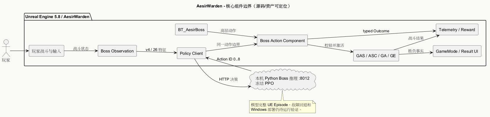

# 技术架构

> 状态：当前源码结构核对 + 未验收的目标链路 · 2026-09-29

## 运行边界

`玩家输入/战斗 → UE 战局状态 → Boss Observation → BT 或 PPO 高层 Action → 共享 Boss Action Component → GAS Ability/Effect → 动画/命中/伤害 → Telemetry → 下一次 Observation`。

可编辑图源：[SystemArchitecture.puml](../../Assets/UML/SystemArchitecture.puml)、[BossDecisionSequence.puml](../../Assets/UML/BossDecisionSequence.puml)。

UE 是目标、状态、能力合法性与伤害结算的权威方。本机 Python Boss 服务仅返回高层动作建议（默认 `127.0.0.1:8012`）；同伴命令服务（默认 `8011`）是独立的后续扩展路径。任何服务响应都不能绕过 UE 的共享执行器。当前依赖见 [Build.cs](../../../Source/AesirWarden/AesirWarden.Build.cs)，协议和动作见[Boss RL 契约](../../08_RL_Research/BossRL_Contract.md)。

## 模块职责

| 部分 | 当前代码/资产 | 责任 |
| --- | --- | --- |
| 玩家与战斗 | `Characters/Player`、`Combat`、`Abilities` | 输入、锁定、受击、运行时属性与能力 |
| Boss 决策 | `AI/Boss`、`Content/Aesir/AI/Boss` | Observation、BT/PPO 请求、回退、动作结果 |
| 共享执行 | `UAesirBossActionComponent`、GAS Ability/Effect | 统一合法性判断与实际能力激活 |
| 战局与呈现 | `Framework`、`Content/Aesir/UI` | 胜负事件、HUD/结果 Widget |
| 同伴服务 | `Services/Companion`、`AI/Companion` | 文本/语音命令和订单校验；真实 GAS 闭环延期 |

## 设计约束

- Observation v4 为 26 维，Action 枚举为 9 类；两端顺序和值变化要升版本并重训。
- BT 与 PPO 共享 GAS 执行、能力配置、遭遇规则和遥测口径；模拟器 `RuleBossPolicy` 不能当 UE BT。
- 一次服务错误、连续失败、超时、错误 Schema 与非法动作必须可区分记录；当前回退代码仍有待修复问题，见[KnownIssues](../../06_Test_Doc/KnownIssues.md)。
- 本目录的 [PlantUML 源](../../Assets/UML/README.md)是图的唯一可编辑版本；Markdown 说明职责与证据，不复制第二份图源。
