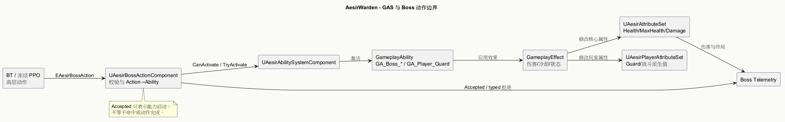

# GAS 架构

> 状态：部分源码/资产核对 · 2026-09-29

可编辑图源：[GasArchitecture.puml](../../Assets/UML/GasArchitecture.puml)。

## 当前组成

| 层 | 当前实现 |
| --- | --- |
| AbilitySystemComponent | [UAesirAbilitySystemComponent](../../../Source/AesirWarden/Public/Abilities/AesirAbilitySystemComponent.h)；角色通过 GAS 接口提供 ASC |
| AttributeSet | [核心 Health/MaxHealth/Damage](../../../Source/AesirWarden/Public/Abilities/AesirAttributeSet.h)；[玩家 GuardPressure、PhysicalPower、DamageReduction、RunePower、CooldownHaste](../../../Source/AesirWarden/Public/Abilities/AesirPlayerAttributeSet.h) |
| GameplayAbility | Boss 攻击、防御、闪避、移动 C++ 基类与对应 `GA_Boss_*` 资产；玩家 Guard/GuardCounter 资产 |
| GameplayEffect/Tag | `GE_Damage_NormalAttack`、Boss 冷却、玩家 GuardBroken 与初始化 GE；标签见 [DefaultGameplayTags.ini](../../../Config/DefaultGameplayTags.ini) |
| 执行入口 | [UAesirBossActionComponent](../../../Source/AesirWarden/Public/AI/Boss/AesirBossActionComponent.h) 负责 Action→配置 Ability 的映射、合法检查和 typed Outcome |

## Boss 动作数据流

`BT/PPO 选 Action → BossActionComponent 验证权威/目标/状态/配置 → ASC CanActivate/TryActivateAbilityByClass → GA 执行动画和命中 → GE 改属性 → Telemetry 记录 Outcome 与结局`。

行动被拒绝时返回 `InvalidAvatar`、`InvalidTarget`、`NotAuthority`、`Dead`、`Stunned`、`Busy`、`MissingAbilitySystem`、`NotConfigured`、`AbilityNotGranted` 或 `BlockedByGAS`。Accepted 表示 GA 成功激活，**不等于命中或最终完成**；实验统计应分开记录。

玩家固有盾防不随未来武器切换而删除。永久属性等级与符文归存档，运行时值通过可调曲线/GE 写入 GAS；曲线、装备授权和完整进度系统目前属于目标设计。[符文设计](../GDD/MagicSystem.md)。
